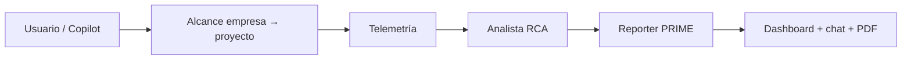

# AIOps Prime Copilot

Plataforma **multiagente** para operaciones en la nube: detecta incidentes desde telemetría, analiza causa raíz, genera reportes ejecutivos **PRIME** y expone todo en un workspace con **copilot conversacional** — con alcance **empresa → proyecto → servicios**.

| | |
|---|---|
| **Problema** | Equipos con logs y métricas en GCP (u otras nubes) tardan en pasar de “hay ruido en telemetría” a “qué falló, por qué importa y qué decir al negocio”, y suelen depender de pipelines monolíticos o de un solo LLM con demasiado contexto. |
| **Solución** | Pipeline especializado en tres roles (telemetría → analista → reporter), orquestado por **Google ADK**, con la misma lógica vía **API REST** o **chat CopilotKit**, estado compartido por `runId` y dashboard que se actualiza en vivo (métricas, coste estimado, salud por proyecto). |
| **Stack** | **Next.js 16** · **React 19** · **Google ADK** + **Gemini / Vertex AI** · **CopilotKit** (AG-UI) · **TypeScript** · **DDD** (backend) · **FSD** (frontend) · **Tailwind 4** · **Framer Motion** · **Vitest** · **Playwright** |



---

## Qué resuelve en la práctica

1. **Telemetría** — incidentes y señales desde logs del alcance elegido (lógica determinística + workers ADK).
2. **Análisis** — causa raíz y remediación por incidente (LLM acotado por rol).
3. **Reporting PRIME** — KPIs, narrativa ejecutiva y analytics por empresa/proyecto.
4. **Copilot** — flujo completo o paso a paso, con confirmaciones humanas (HITL) cuando aplica.
5. **Workspace unificado** — overview operativo, incidentes, catálogo de proyectos, UI generativa y **report canvas** (secciones editables, revisión Approve/Ask why/Reject, sugerencias vía copilot) exportable a PDF.

Detalle de pipeline, scope y caché: **[docs/logic/README.md](./docs/logic/README.md)** · KPIs y health score: **[docs/logic/project-company-analytics-spec.md](./docs/logic/project-company-analytics-spec.md)**

---

## Stack y piezas clave

| Área | Tecnología | Rol |
|------|------------|-----|
| **Frontend** | Next.js 16, React 19, Tailwind 4, Framer Motion | App Router, workspace `/aiops`, animaciones y skeletons en dashboard |
| **Chat / UI agente** | CopilotKit (`@copilotkit/react-core`, runtime) | Chat, tools frontend/backend, protocolo **AG-UI**, sincronización con sesión |
| **Orquestación IA** | Google ADK (`@google/adk`) | `aiops_coordinator` + workers: telemetría, analista, reporter |
| **Modelos** | Gemini / Vertex AI (`GOOGLE_API_KEY` o ADC) | Coordinador y workers; fallback legacy sin ADK vía `COPILOTKIT_MODEL` |
| **Backend** | TypeScript, capas DDD | `domain` → `application` (use cases) → `infrastructure` → `interface` (API) |
| **Estado** | `artifactCache` (cliente) + store por `runId` (servidor) | Mismos artefactos para API, stream y Copilot |
| **Calidad** | Vitest, Playwright, ESLint | Unitarios, E2E (`/aiops`), build CI |

Arquitectura ampliada: **[docs/platform/README.md](./docs/platform/README.md)** · Diagramas: **[docs/platform/diagramas/](./docs/platform/diagramas/)** · Decisiones: **[docs/decisiones-arquitectura-agentes.md](./docs/decisiones-arquitectura-agentes.md)**

---

## Inicio rápido

```bash
npm install
cp .env.example .env.local   # GOOGLE_API_KEY o Vertex; ver tabla abajo
npm run dev                  # → http://localhost:3000/aiops
```

| Comando | Uso |
|---------|-----|
| `npm run test` | Tests unitarios (Vitest) |
| `npm run test:e2e` | E2E Playwright |
| `npm run lint && npm run build` | Calidad + build producción |

### Variables de entorno (principales)

| Variable | Uso |
|----------|-----|
| `GOOGLE_GENAI_USE_VERTEXAI` | Vertex vs API key |
| `GOOGLE_CLOUD_PROJECT`, `GOOGLE_CLOUD_LOCATION` | Proyecto Vertex |
| `GOOGLE_API_KEY` | Gemini (si no usas ADC) |
| `ADK_MODEL` / `GEMINI_MODEL` | Modelo coordinador y workers ADK |
| `COPILOTKIT_MODEL` | Fallback sin ADK |
| `NEXT_PUBLIC_COPILOT_RUNTIME_URL` | Runtime Copilot (default `/api/copilotkit`) |

Estado del runtime: `GET /api/aiops/runtime-status`

---

## Para evaluadores (reto técnico)

| Entregable | Documento |
|------------|-----------|
| Índice completo | [docs/ENTREGABLES.md](./docs/ENTREGABLES.md) |
| Diagramas (ADK + CopilotKit) | [docs/platform/diagramas/](./docs/platform/diagramas/) |
| Decisiones (1 pág.) | [docs/platform/decisiones-1-pagina.md](./docs/platform/decisiones-1-pagina.md) |
| Decisiones (extendido) | [docs/decisiones-arquitectura-agentes.md](./docs/decisiones-arquitectura-agentes.md) |
| Demo en vivo | [docs/DEMO-SUSTENTACION.md](./docs/DEMO-SUSTENTACION.md) |
| Uso de IA / SDD | [docs/metodologia-desarrollo-con-ia.md](./docs/metodologia-desarrollo-con-ia.md) |

Guion de demo: **[docs/DEMO-SUSTENTACION.md](./docs/DEMO-SUSTENTACION.md)** — ejemplo en chat: *“Run telemetry for Project Gem (projectId: project-gem, companyId: acme-corp)”*.

---

## Interfaz (`/aiops`)

Una ruta; navegación por sidebar y modos **Dashboard · Split · Chat · Avatar**. Incluye overview con métricas y coste ligados a telemetría, tablas por proyecto/servicio, copilot y report canvas (PDF).

Mapa UI y generativa: **[docs/ui/README.md](./docs/ui/README.md)** · CopilotKit cliente: **[docs/frontend/copilotkit.md](./docs/frontend/copilotkit.md)**

---

## APIs (referencia rápida)

| Método | Ruta | Uso |
|--------|------|-----|
| `POST` | `/api/aiops/analyze` | Pipeline completo (JSON) |
| `POST` | `/api/aiops/analyze/stream` | Pipeline + progreso NDJSON |
| `GET` | `/api/aiops/ownership/projects` | Catálogo empresa / proyecto / servicios |
| `POST` | `/api/copilotkit` | Runtime CopilotKit + agentes ADK |
| `POST` | `/api/aiops/report-pdf` | Export PDF del report canvas |
| `GET` | `/api/aiops/runtime-status` | Config Gemini/Vertex |

**Ejemplo** — analizar Project Gem:

```json
POST /api/aiops/analyze
{
  "companyId": "acme-corp",
  "projectId": "project-gem",
  "timeWindowMinutes": 60
}
```

Contratos y capas: **[docs/backend/README.md](./docs/backend/README.md)**

---

## Datos demo (seed)

| Empresa | Proyectos |
|---------|-----------|
| `acme-corp` (Acme Corp) | `project-gem`, `project-nova` |
| `stellar-inc` (Stellar Inc) | `project-orbit`, `project-pulse` |

| Proyecto | Servicios (ejemplo) |
|----------|---------------------|
| Project Gem | `auth-service`, `payments-api`, `worker-sync`, `notifications` |
| Project Nova | `catalog-api`, `search-api`, `recommendations` |
| Project Orbit | `billing-api`, `ledger-worker`, `invoice-pdf` |
| Project Pulse | `metrics-ingest`, `alert-router` |

Logs: `file-logs-repository` · mock: `GET /api/mock/telemetry`

---

## Documentación

| Tema | Enlace |
|------|--------|
| Índice `docs/` | [docs/README.md](./docs/README.md) |
| Entregables reto | [docs/ENTREGABLES.md](./docs/ENTREGABLES.md) |
| Lógica y pipeline | [docs/logic/README.md](./docs/logic/README.md) |
| Plataforma / ADK | [docs/platform/README.md](./docs/platform/README.md) |
| Metodología SDD + IA | [docs/metodologia-desarrollo-con-ia.md](./docs/metodologia-desarrollo-con-ia.md) |

---

## Compatibilidad

Clientes que envían solo `services` y/o `timeWindowMinutes` siguen funcionando. Los campos de jerarquía (`companyId`, `projectId`) son opcionales; resúmenes por proyecto/empresa aparecen cuando el scope se resuelve vía ownership.
