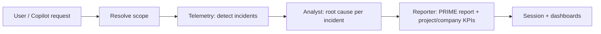

# AIOps Prime Copilot

Multi-agent AIOps workspace for incident detection, root-cause analysis, and executive PRIME reporting—with optional **company → project → services** scope for leadership KPIs and recommendations.

**Stack:** Next.js 16 (App Router) · Google ADK (TypeScript) + Gemini/Vertex · CopilotKit · DDD/Clean Architecture (backend) · Feature-Sliced Design (frontend)

---

## Table of contents

1. [Pages and UI](#pages-and-ui)
2. [End-to-end business flow](#end-to-end-business-flow)
3. [Scope and ownership model](#scope-and-ownership-model)
4. [Agent pipeline (business logic)](#agent-pipeline-business-logic)
5. [KPIs, health score, and recommendations](#kpis-health-score-and-recommendations)
6. [API reference](#api-reference)
7. [Copilot and session state](#copilot-and-session-state)
8. [Architecture map](#architecture-map)
9. [Seeded demo data](#seeded-demo-data)
10. [Run and validate](#run-and-validate)

---

## Pages and UI

### Routes

| Route | File | Behavior |
|-------|------|----------|
| `/` | `src/app/page.tsx` | Redirects to `/aiops` |
| `/aiops` | `src/app/aiops/page.tsx` → `src/fsd/pages/aiops/ui/aiops-page.tsx` | Main product surface |

There is a single product page. All workspace navigation happens **inside** `/aiops` via sidebar state (not separate URLs).

### Workspace layout

`AIOpsPage` wraps:

1. **`AIOpsSessionProvider`** — global analysis state, project catalog, artifact cache, workflow stage, agent pipeline progress.
2. **`AIOpsWorkspaceLayout`** — shell: sidebar, top bar, view modes, center content, docked/full copilot.

**View modes** (`ViewModeToggle`):

- **Dashboard** — center panels only
- **Split** — dashboard + docked copilot (default on large screens)
- **Chat** — full-width copilot assistant
- **Avatar** — split with avatar-focused copilot panel

**Sidebar sections** (`AppNavId` → center content):

| Nav ID | Component | What it shows |
|--------|-----------|----------------|
| `overview` | `OperationsOverviewDashboard` | KPI cards, severity chart, service impact, health radar, operational map, active incidents |
| `incidents` | `IncidentDashboard` | Incident table, per-service breakdown, analysis summaries |
| `prime` | `PrimeReportViewer` | PRIME KPIs, narrative, project/company analytics charts, recommendations |
| `projects` | `ProjectCatalog` | Companies/projects catalog; run scoped analysis per project |
| `services`, `recommendations`, `settings` | (sidebar labels) | Reserved for future sections; not wired to distinct views yet |

**Always visible:**

- **`AgentPipelineLive`** — live status for scope → telemetry → analyst → reporter
- **`CopilotAssistantPanel`** — CopilotKit chat (docked or full) with incremental agent tools
- **`VoiceCommandBar`** — overview-only voice UX placeholder (large screens)

### How the UI gets data

1. **Manual analysis** — user picks a project in **Projects** or triggers analysis from copilot; session calls `POST /api/aiops/analyze/stream` (NDJSON progress) or falls back to non-streaming analyze.
2. **Copilot analysis** — ADK tools (`runTelemetryAgent`, `runAnalystAgent`, `runReporterAgent`, `analyzeLogs`) update the same session **artifact cache** incrementally.
3. **Dashboards read session** — `useAIOpsSession()` exposes `result`, `artifactCache`, `selectedScope`, `workflow`, `agentPipeline`. Components prefer `result` and fall back to `artifactCache` so partial copilot runs still render.

---

## End-to-end business flow

High-level path from user intent to UI:



### 1. Request intake

Payload (`AnalyzeLogsPayload`):

```ts
{
  prompt?: string;
  companyId?: string;
  projectId?: string;
  services?: string[];
  timeWindowMinutes?: number;
}
```

- Validated by `analyzeLogsRequestSchema` (`src/backend/interface/http/analyze-request-schema.ts`).
- `prompt` is used by Copilot/orchestration; the core use case keys off scope + time window.

### 2. Scope resolution

`AnalyzeLogsUseCase` → `resolveHierarchicalScope()` (`src/backend/application/shared/hierarchical-scope-resolver.ts`):

- Loads ownership from `InMemoryProjectOwnershipRepository` when `companyId` and/or `projectId` are present.
- Produces **service list** + resolved company/project metadata for the response `query` block.

See [Scope and ownership model](#scope-and-ownership-model).

### 3. Telemetry (incident detection)

`TelemetryAgent.detectIncidents()`:

- Filters logs by resolved services (if scope is explicit) and optional `TimeWindow`.
- **Log pipeline:** sort → normalize severity → noise filter (`log-processing-chain.ts`).
- **Grouping:** by service, region, and error code (`GroupByServiceRegionAndErrorCodeStrategy`).
- **Output:** `Incident[]` with severity, duration, fingerprint, status, log count.

If `timeWindowMinutes` is omitted, the use case later derives the window from incident `startedAt` / `endedAt`, or defaults to **last 60 minutes** when there are no incidents.

### 4. Analyst (root cause + remediation)

For each incident (when count > 0):

- `AIOpsAnalystAgent.analyzeIncidents()` produces `Analysis`:
  - **Summary** — human-readable incident synopsis
  - **RootCause** — hypothesis, evidence[], confidence (0–1)
  - **RemediationPlan** — steps, automation flag, estimated minutes

Progress events (`incident_analyzed`) stream partial snapshots to the UI during streaming analyze.

### 5. Reporter (PRIME + hierarchical summaries)

`PrimeReporterAgent.buildPrimeReport()`:

- **Service-level KPIs** — `KpiCalculator` (MTTR, auto-handleable rate, incident density, root-cause confidence)
- **Narrative** — `PrimeNarrativeBuilder` (+ optional Gemini enrichment when configured)
- **Project-level** (when scope resolves to a project):
  - `ProjectKpiAggregator` — health score + project KPIs
  - `project-scope-insights` — severity mix, incident trend
  - `RecommendationBuilder` — P0/P1/P2 actions
- **Company-level** (when company scope without single project):
  - `CompanyKpiAggregator` — rolled-up company KPIs and top risks

### 6. Response assembly

`AnalyzeLogsResult` includes:

- `query` — requested vs resolved scope and time window
- `incidents`, `analyses`, `primeReport`
- `ui` — generative blocks: `IncidentTable`, `PrimeKpiCards`, `PrimeNarrative`

---

## Scope and ownership model

### Entities

- **Company** — `id`, `name` (domain); catalog uses `companyId` keys
- **Project** — `id`, `companyId`, `name`, `serviceNames[]`

Port: `ProjectOwnershipRepository`  
Implementation: `InMemoryProjectOwnershipRepository` (seeded list; see [Seeded demo data](#seeded-demo-data)).

### Resolution rules

| Request | Resolved services | Resolved metadata |
|---------|-------------------|-------------------|
| `projectId` only | All services owned by that project | `resolvedProjectId`, `resolvedProjectName`, `resolvedCompanyId` |
| `projectId` + `services[]` | **Intersection** with project-owned services | Same as above |
| `companyId` only (no project) | **Union** of all services across company projects | `resolvedCompanyId`; project fields null |
| `companyId` + `services[]` | Intersection with company union | Company resolved |
| No company/project | Legacy behavior: optional `services[]` only; if empty, telemetry scans **all** available services | Hierarchy fields null |

Service names are normalized to lowercase trimmed strings everywhere in resolution.

### Ownership API

`GET /api/aiops/ownership/projects?companyId=&projectId=`

Returns `{ projects: [{ id, companyId, name, serviceNames[] }] }`.

Used on session mount and by Copilot tool `listProjectOwnership` to populate the project catalog and auto-fill services when a project is selected.

---

## Agent pipeline (business logic)

Orchestrated by `AnalyzeLogsUseCase.executeWithProgress()`:

| Step | Agent ID | Responsibility |
|------|----------|----------------|
| 1 | `scope` | Resolve company/project/services and describe locked scope |
| 2 | `telemetry` | Detect incidents from observability logs |
| 3 | `analyst` | Per-incident root cause and remediation (skipped if zero incidents) |
| 4 | `reporter` | PRIME KPIs, narrative, optional project/company summaries |

**Incremental Copilot path** (same business rules, split use cases):

| Tool | Use case | Produces |
|------|----------|----------|
| `listProjectOwnership` | ownership handler | Project catalog |
| `runTelemetryAgent` | `RunTelemetryUseCase` | Incidents + `query` |
| `runAnalystAgent` | `RunAnalystUseCase` | Analyses (needs incidents in cache or args) |
| `runReporterAgent` | `RunReporterUseCase` | PRIME report from cache |
| `analyzeLogs` | Full `AnalyzeLogsUseCase` | Complete result |

Copilot runtime: `POST /api/copilotkit` wires ADK-backed tools and a built-in orchestration agent (`COPILOTKIT_MODEL`).

---

## KPIs, health score, and recommendations

### Service-level PRIME KPIs (`KpiCalculator`)

| KPI | Meaning |
|-----|---------|
| **MTTR** | Mean time to resolve (minutes) across incidents |
| **Auto-handleable incident rate** | % of incidents flagged as automation candidates |
| **Incident density** | Incidents per hour in the resolved time window |
| **Root-cause confidence** | Average analyst confidence × 100 |

Trend arrows (`up` / `down` / `flat`) are rule-based thresholds in the calculator.

### Project-level KPIs (`ProjectKpiAggregator`)

Includes volume, **Critical Incident Rate**, **Service Stability Coverage** (% services with zero critical incidents), **Recurrent Incident Ratio** (repeated fingerprints), and **Project Health Score (0–100)**.

**Health score weights** (constants in code for auditability):

| Factor | Weight |
|--------|--------|
| MTTR (normalized inverse) | 30% |
| Critical incident rate | 25% |
| Auto-handleable rate | 20% |
| Root-cause confidence | 15% |
| Recurrent incident ratio | 10% |

Normalization caps: e.g. MTTR worst case 60 min, critical rate worst 40%, recurrent ratio worst 35% (`PROJECT_HEALTH_NORMALIZATION`).

### Recommendations (`RecommendationBuilder`)

Derived from health score, critical rate, recurrent ratio, stability coverage:

| Condition | Priority | Risk |
|-----------|----------|------|
| Health &lt; 50 or critical rate &gt; 25% | P0 | high |
| Health &lt; 75 or recurrent &gt; 15% | P1 | medium |
| Otherwise | P2 | low |

Each recommendation includes **evidence** (metric strings), **immediate** (24h), **shortTerm** (7d), **strategic** (30d) actions, and a **confidence** score.

### Company-level (`CompanyKpiAggregator`)

Rolls up project-style metrics when `companyId` scope applies without a single project; exposes `companySummary` on `PrimeReport` with `topRisks` and company recommendation.

---

## API reference

| Method | Path | Purpose |
|--------|------|---------|
| `POST` | `/api/aiops/analyze` | Full pipeline; JSON result |
| `POST` | `/api/aiops/analyze/stream` | Same pipeline; NDJSON `AnalysisProgressEvent` lines |
| `POST` | `/api/aiops/prime-report` | Reporter-focused path (business summary use case available) |
| `GET` | `/api/aiops/ownership/projects` | Project/service ownership catalog |
| `GET` | `/api/aiops/runtime-status` | Gemini/Vertex configuration status |
| `GET` | `/api/mock/telemetry` | Mock telemetry feed for demos |
| `POST` | `/api/copilotkit` | CopilotKit runtime + ADK agent tools |

### Example: analyze Project Gem

```json
POST /api/aiops/analyze
{
  "companyId": "acme-corp",
  "projectId": "project-gem",
  "timeWindowMinutes": 60
}
```

Resolves to services: `auth-service`, `payments-api`, `worker-sync`, `notifications`.

### Analyze response shape (summary)

```ts
{
  query: {
    requestedCompanyId, requestedProjectId,
    resolvedCompanyId, resolvedProjectId, resolvedProjectName,
    resolvedServiceCount, requestedServices, analyzedServices,
    requestedTimeWindowMinutes, resolvedTimeWindowMinutes,
    resolvedWindowFrom, resolvedWindowTo
  },
  incidents: IncidentViewModel[],
  analyses: AnalysisViewModel[],
  primeReport: PrimeReportViewModel,  // includes optional projectSummary / companySummary
  ui: GenerativeUiBlock[]
}
```

---

## Copilot and session state

### Session provider (`src/processes/aiops-analysis-session/model/aiops-session-context.tsx`)

| State | Role |
|-------|------|
| `artifactCache` | Normalized incidents, analyses, PRIME report, query — updated incrementally by copilot tools |
| `projectCatalog` | Loaded once via ownership API |
| `selectedScope` | User-selected company/project/services |
| `result` | Latest full analyze result |
| `workflow` | `idle` → `collecting_scope` → `reading_telemetry` → `root_cause_analysis` → `reporting` → `ready` / `error` |
| `agentPipeline` | Per-agent running/complete/failed steps |
| `runAnalysis()` | Calls streaming analyze API and merges progress |
| `applyIncrementalToolResult()` | Maps copilot tool output into artifact cache |

### UI features tied to copilot

- **`AIOpsCopilot`** + **`IncrementalAgentTools`** — render tool cards, suggestions, HITL where configured
- **`copilot-analysis-bridge`** — prefix/constants for post-ADK analysis handoff
- **`coerce-agent-tool-result`** — normalizes `{ ok, data }` tool payloads

Env: `NEXT_PUBLIC_COPILOT_RUNTIME_URL` (default `/api/copilotkit`).

---

## Architecture map

### Backend (DDD + Clean)

```
src/backend/
├── domain/
│   ├── common/              # Severity, ServiceName, TimeWindow
│   ├── observability/       # LogEntry, Incident, grouping, detection
│   ├── aiops-analysis/      # Analysis, RootCause, RemediationPlan
│   ├── prime-reporting/     # PrimeKpi, PrimeReport, KpiCalculator, narrative
│   └── project-analytics/   # Company, Project, aggregators, recommendations
├── application/
│   ├── use-cases/           # AnalyzeLogs, RunTelemetry/Analyst/Reporter, GenerateBusinessSummary
│   ├── contracts/           # Ports, DTOs, progress events
│   └── shared/              # hierarchical-scope-resolver, mappers
├── infrastructure/
│   ├── adk/                 # ADK agents + factories
│   ├── repositories/        # file logs, in-memory ownership
│   └── bootstrap.ts         # Wire use cases
└── interface/http/          # Zod schemas, ownership handlers
```

### Frontend (FSD-style)

```
src/
├── app/                     # Next.js routes + API route handlers
├── fsd/pages/aiops/         # Page composition
├── processes/aiops-analysis-session/  # Session orchestration
├── features/                # aiops-copilot, dashboards, prime-report-viewer, project-scope, …
├── entities/                # prime + project-analytics UI building blocks
└── shared/                  # types, API clients, dashboard/layout UI
```

### Domain contexts (what each owns)

| Context | Responsibility |
|---------|----------------|
| **Observability** | Ingest logs, detect/group incidents, severity and fingerprints |
| **AIOps Analysis** | Root-cause hypotheses and remediation plans per incident |
| **PRIME Reporting** | Executive KPIs, narrative, business summary |
| **Project Analytics** | Ownership, project/company aggregation, health score, recommendations |

---

## Seeded demo data

### Companies and projects

| Company ID | Display | Projects |
|------------|---------|----------|
| `acme-corp` | Acme Corp | **Project Gem** (`project-gem`), **Project Nova** (`project-nova`) |
| `stellar-inc` | Stellar Inc | **Project Orbit** (`project-orbit`), **Project Pulse** (`project-pulse`) |

### Project → services

| Project | Services |
|---------|----------|
| Project Gem | `auth-service`, `payments-api`, `worker-sync`, `notifications` |
| Project Nova | `catalog-api`, `search-api`, `recommendations` |
| Project Orbit | `billing-api`, `ledger-worker`, `invoice-pdf` |
| Project Pulse | `metrics-ingest`, `alert-router` |

Telemetry/logs come from `file-logs-repository` / mock telemetry API (`sample-logs.json` and mock routes).

---

## Run and validate

### 1. Install

```bash
npm install
```

### 2. Environment

```bash
cp .env.example .env.local
```

Key variables:

| Variable | Purpose |
|----------|---------|
| `GOOGLE_GENAI_USE_VERTEXAI` | Use Vertex vs API key |
| `GOOGLE_CLOUD_PROJECT`, `GOOGLE_CLOUD_LOCATION` | Vertex project |
| `ADK_MODEL` / `GEMINI_MODEL` | Backend ADK agents |
| `COPILOTKIT_MODEL` | Copilot orchestration model |
| `NEXT_PUBLIC_COPILOT_RUNTIME_URL` | Browser CopilotKit endpoint |

### 3. Dev server

```bash
npm run dev
```

Open: **http://localhost:3000/aiops**

### 4. Quality gates

```bash
npm run test
npm run lint
npm run build
```

---

## Related documentation

- **SPEC-009 (company/project analytics):** `docs/project-company-analytics-spec.md` — requirements, KPI definitions, and compatibility rules that this README summarizes.

---

## Backward compatibility

Existing clients that only send `services` and/or `timeWindowMinutes` continue to work: hierarchy fields are optional, and when omitted the platform uses the same service-centric telemetry and PRIME pipeline as before. Project/company summaries appear only when scope resolves through ownership metadata.
