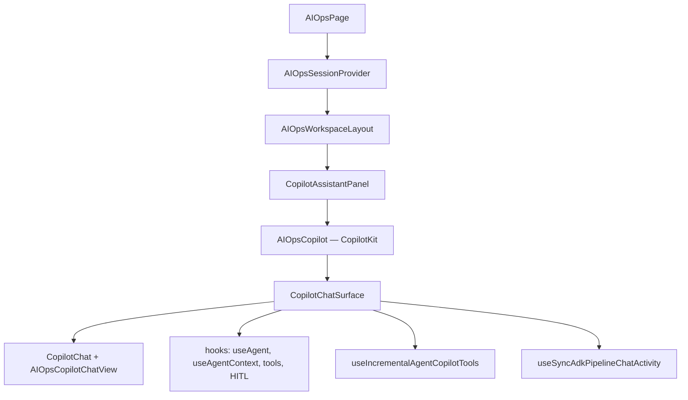
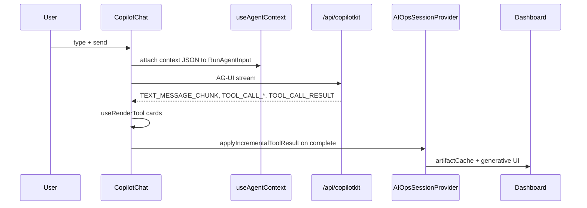
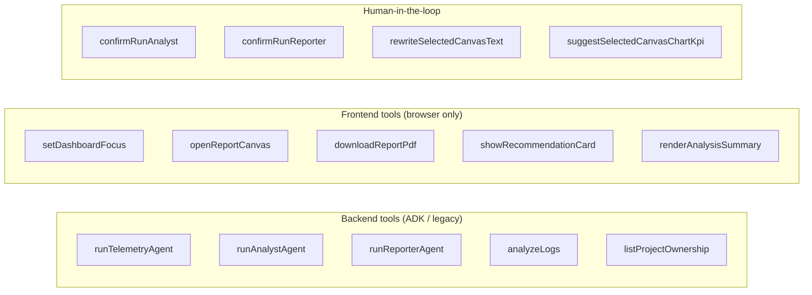

# CopilotKit on the frontend

How **CopilotKit React v2** is integrated in AIOps Prime: provider setup, agent context, backend vs frontend tools, human-in-the-loop, and syncing chat with the dashboard.

> Server/runtime side: [../platform/README.md](../platform/README.md) · AG-UI events: [../ui/ag-ui-protocol.md](../ui/ag-ui-protocol.md)

---

## Component tree



**Entry files**

| File | Export |
|------|--------|
| `src/fsd/pages/aiops/ui/aiops-page.tsx` | Page composition |
| `src/features/aiops-copilot/ui/aiops-copilot.tsx` | `AIOpsCopilot`, `CopilotChatSurface` |
| `src/features/aiops-copilot/ui/incremental-agent-tools.tsx` | `useIncrementalAgentCopilotTools` |
| `src/features/aiops-copilot/ui/aiops-copilot-chat-view.tsx` | Custom chat chrome |
| `src/features/copilot-assistant/ui/copilot-assistant-panel.tsx` | Docked / avatar shell |

---

## 1. Provider (`AIOpsCopilot`)

```tsx
<CopilotKit
  runtimeUrl={process.env.NEXT_PUBLIC_COPILOT_RUNTIME_URL ?? "/api/copilotkit"}
  useSingleEndpoint
  debug={false}
  renderActivityMessages={[adkPipelineActivityRenderer]}
>
  <CopilotChatSurface />
</CopilotKit>
```

| Prop | Meaning |
|------|---------|
| `runtimeUrl` | Single POST target for AG-UI runs (default `/api/copilotkit`) |
| `useSingleEndpoint` | CopilotKit v2 single-route mode (matches server `mode: "single-route"`) |
| `renderActivityMessages` | Custom renderers for `role: "activity"` messages in the thread |

The **agent id** used everywhere is `"default"` (matches `CopilotRuntime.agents.default` on the server).

---

## 2. Message flow (what happens when the user sends chat)



CopilotKit handles streaming UI; **your code** reacts in `useRenderTool` / `IncrementalToolCard` when tools complete.

---

## 3. Session state ↔ agent (`useAgentContext`)

Every turn, the frontend sends **read-only context** so ADK (or legacy agent) sees cache, scope, and UI state without extra round-trips.

### Two context blobs

```tsx
useAgentContext({
  description: "Current AIOps session artifact cache and dashboard viewport",
  value: sharedContext,  // incidents, analyses, primeReport, workflow, …
});

useAgentContext({
  description: "Structured workspace state for chat-with-your-data",
  value: workspaceState,  // from buildAIOpsWorkspaceState()
});
```

| Source | Built from |
|--------|------------|
| `sharedContext` | `artifactCache`, `result`, catalog, `workflow`, `agentPipeline`, canvas |
| `workspaceState` | `buildAIOpsWorkspaceState()` — nav, focus, analysis summary KPIs |

### Agent state mirror

```tsx
useEffect(() => {
  agent.setState({ ...workspaceState, selectedCanvasBlockId });
}, [agent, workspaceState, selectedCanvasBlockId]);
```

`useAgent({ agentId: "default" })` exposes the live agent for activity sync and state patches.

**Rule:** Keep `runId` / `lastRunMeta` in `artifactCache` aligned with backend tool results so analyst/reporter tools find data server-side.

---

## 4. Tool types on the frontend

CopilotKit distinguishes **where tools execute**:



### Backend tools — `useRenderTool`

Defined on the **server** (ADK `FunctionTool` or `defineTool`). The UI only **renders** execution status and applies results.

| Tool | UI hook | On `complete` |
|------|---------|----------------|
| `runTelemetryAgent` | `useRenderTool` → `IncrementalToolCard` | `applyIncrementalToolResult` → cache + dashboard |
| `runAnalystAgent` | same | same |
| `runReporterAgent` | same | cache + `generateReportCanvas()` |
| `analyzeLogs` | same | full result + canvas |

Implementation: `src/features/aiops-copilot/ui/incremental-agent-tools.tsx`

**`IncrementalToolCard` lifecycle**

1. `executing` / `inProgress` → update `workflow` + `agentPipeline` via `applyCopilotAgentProgress`
2. `complete` → `parseAgentToolResult` → `onApplyIncremental` or legacy `onApplyResult`
3. Reporter / full pipeline → auto-open report canvas

Telemetry/analyst cards hide spinners in chat (data goes to dashboard); reporter shows completion hint.

### Frontend tools — `useFrontendTool`

Handler runs **in the browser**; optional `render` for inline status.

| Tool | Handler effect |
|------|----------------|
| `setDashboardFocus` | Updates `dashboardFocus` (overview / project / service) |
| `openReportCanvas` | Opens report layer or calls `generateReportCanvas()` |
| `downloadReportPdf` | `downloadReportCanvasPdf()` API client |
| `showRecommendationCard` | `dashboardFocus.scope = "recommendation"` |
| `renderAnalysisSummary` | Renders `AnalysisSummaryChatCard` in chat |

Defined in: `src/features/aiops-copilot/ui/aiops-copilot.tsx`

The model must **call** these tools; they are registered client-side only (not in ADK `FunctionTool` list unless you add matching server stubs).

### Human-in-the-loop — `useHumanInTheLoop`

Pauses the agent until the user clicks **Approve / Deny** (`respond()`).

| Tool | When |
|------|------|
| `confirmRunAnalyst` | Before expensive analyst run |
| `confirmRunReporter` | Before PRIME report generation |
| `rewriteSelectedCanvasText` | Approve canvas text edits |
| `suggestSelectedCanvasChartKpi` | Approve chart KPI changes |

HITL UI is **React-only** — not enforced inside ADK. The coordinator relies on prompts + context; confirmations are initiated from tool calls the model makes.

---

## 5. Chat suggestions

`useCopilotChatSuggestions` (from `@copilotkit/react-core`) in `incremental-agent-tools.tsx`:

- Static prompts: “Analysis summary”, “My projects”, “Run telemetry”
- **Dynamic** chips when `artifactCache.incidents` exist (“Run analyst”, “Generate PRIME report”)
- Scoped project chip when `selectedScope` is set

`available: "after-first-message"` — welcome screen stays clean.

---

## 6. Activity messages (pipeline in chat)

Backend `STATE_SNAPSHOT` is not the only pipeline UI. The app **injects** an activity message from session state:

```text
useSyncAdkPipelineChatActivity(agent)
  → reads agentPipeline, isAnalyzing from useAIOpsSession()
  → agent.setMessages([...]) with role: "activity"
  → adkPipelineActivityRenderer renders AgentPipelineLive (compact)
```

Files:

- `src/features/agent-pipeline/hooks/use-sync-adk-pipeline-chat-activity.ts`
- `src/features/agent-pipeline/ui/adk-pipeline-chat-activity.tsx`
- `src/features/agent-pipeline/model/adk-pipeline-activity.ts`

This keeps pipeline progress visible even when backend tool cards are minimal.

---

## 7. Custom chat UI (`AIOpsCopilotChatView`)

`CopilotChat` uses a custom view built from CopilotKit primitives:

- `CopilotChatView.WelcomeScreen` — avatar, intro, suggestions slot
- Styled assistant / user message classes (`aiops-copilot-assistant-msg`, etc.)
- Framer Motion on welcome (respects `prefers-reduced-motion`)

File: `src/features/aiops-copilot/ui/aiops-copilot-chat-view.tsx`

---

## 8. Workspace layout + view modes

`CopilotAssistantPanel` receives `<AIOpsCopilot />` as `chat` prop from `AIOpsWorkspaceLayout`.

| View mode | Copilot behavior |
|-----------|------------------|
| `split` | Docked copilot beside dashboard |
| `chat` | Full-width chat |
| `avatar` | Avatar tab + chat content |
| `dashboard` | Copilot hidden (dashboard only) |

Report layer open forces split when user was in full chat (see `aiops-workspace-layout.tsx`).

---

## 9. Applying tool results (shared lib)

Backend tools return JSON like `{ ok: true, data, cachePatch, ui, runId }`.

| Function | Role |
|----------|------|
| `parseAgentToolResult` | Type-safe parse |
| `applyAgentToolToCache` | Merge into `artifactCache` per tool id |
| `coerceAnalyzeLogsResult` | Legacy full-result shape |
| `mergeGenerativeUiBlocks` | Dashboard `ui` array |

Called from session: `applyIncrementalToolResult`, `applyResultFromCopilot`.

Path: `src/shared/lib/coerce-agent-tool-result.ts`

---

## 10. Env & debugging

| Variable | Frontend effect |
|----------|-----------------|
| `NEXT_PUBLIC_COPILOT_RUNTIME_URL` | Override copilot endpoint |

**Check orchestrator mode:** `GET /api/aiops/runtime-status` — ADK vs legacy changes server behavior, not CopilotKit React APIs.

**Common issues**

| Symptom | Likely cause |
|---------|----------------|
| Analyst says “no incidents” | `runId` / cache not in `useAgentContext` or server store cleared |
| Tools show in chat but dashboard empty | `useRenderTool` complete handler not firing; check `parseAgentToolResult` |
| HITL never appears | Model didn’t call `confirmRun*`; add prompt or call from frontend |
| Pipeline not in chat | `isAnalyzing` false and all pipeline steps `pending` |

---

## 11. Adding a new frontend Copilot feature

### New backend tool (server + UI card)

1. Add ADK/legacy tool on server.
2. Add to `COPILOT_BACKEND_TOOL_NAMES` in bridge mapper.
3. `useRenderTool({ name: "yourTool", render: IncrementalToolCard })`.
4. Extend `applyIncrementalToolResult` / `AIOpsAgentToolId` if needed.

### New browser-only action

1. `useFrontendTool({ name, parameters, handler, render? })` in `aiops-copilot.tsx`.
2. Document the tool in coordinator prompt (so the model knows to call it).
3. Optionally expose in `useCopilotChatSuggestions`.

### New HITL gate

1. `useHumanInTheLoop({ name, parameters, render: ({ respond }) => … })`.
2. Teach the model to call it before a risky backend tool.

---

## 12. Package imports cheat sheet

```tsx
// Provider + chat (v2)
import {
  CopilotKit,
  CopilotChat,
  useAgent,
  useAgentContext,
  useFrontendTool,
  useHumanInTheLoop,
  useRenderTool,
} from "@copilotkit/react-core/v2";

// Suggestions (v1 export path in this repo)
import { useCopilotChatSuggestions } from "@copilotkit/react-core";
```

---

## Related

- [README.md](./README.md) — frontend doc index
- [../ui/ag-ui-protocol.md](../ui/ag-ui-protocol.md) — event types on the wire
- [../ui/generative-ui.md](../ui/generative-ui.md) — dashboard blocks after tools complete
- [../logic/README.md](../logic/README.md) — what backend tools actually run
