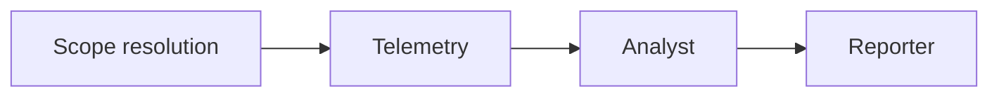

# Business logic layer

Application rules between **UI/API** and **domain**. Orchestrates the AIOps pipeline: scope → telemetry → analyst → reporter.

> Analytics & ownership spec: [project-company-analytics-spec.md](./project-company-analytics-spec.md)

---

## Pipeline overview



| Step | Agent ID | Use case | Output |
|------|----------|----------|--------|
| Scope | `scope` | `resolveHierarchicalScope` | company/project/services, time window |
| Telemetry | `telemetry` | `RunTelemetryUseCase` | incidents + `runId` |
| Analyst | `analyst` | `RunAnalystUseCase` | per-incident analyses |
| Reporter | `reporter` | `RunReporterUseCase` | PRIME KPIs + narrative |

**Full pipeline:** `AnalyzeLogsUseCase.executeWithProgress()` — used by dashboard stream API and `analyzeLogs` tool.

---

## Incremental execution (chat & tools)

Same rules, split invocations:

| Tool / entry | Use case | Requires |
|--------------|----------|----------|
| `listProjectOwnership` | ownership handler | — |
| `runTelemetryAgent` | `RunTelemetryUseCase` | optional scope args |
| `runAnalystAgent` | `RunAnalystUseCase` | incidents in store (`runId`) |
| `runReporterAgent` | `RunReporterUseCase` | cache (analyses optional with flags) |
| `analyzeLogs` | `AnalyzeLogsUseCase` | user intent for full run |

Workers in ADK **do not wait** for each other. The coordinator (or user) decides order; use cases **validate** prerequisites.

---

## Artifact cache (`runId`)

Server-side store for cross-tool continuity:

**File:** `src/backend/infrastructure/session/in-memory-artifact-store.ts`

| Method | Effect |
|--------|--------|
| `saveTelemetry(runId, query, incidents)` | Creates/updates run |
| `saveAnalyses(runId, analyses)` | Merges analyses |
| `get(runId)` | Returns query + incidents + analyses |

Client mirror: `AIOpsSessionProvider.artifactCache` + `applyIncrementalToolResult()` in `src/shared/lib/coerce-agent-tool-result.ts`.

**Limitation:** In-memory only — lost on server restart.

---

## Use case map

| Class | Path |
|-------|------|
| `AnalyzeLogsUseCase` | `src/backend/application/use-cases/analyze-logs-use-case.ts` |
| `RunTelemetryUseCase` | `src/backend/application/use-cases/run-telemetry-use-case.ts` |
| `RunAnalystUseCase` | `src/backend/application/use-cases/run-analyst-use-case.ts` |
| `RunReporterUseCase` | `src/backend/application/use-cases/run-reporter-use-case.ts` |
| `GenerateBusinessSummaryUseCase` | `src/backend/application/use-cases/generate-business-summary-use-case.ts` |

Wiring: `src/backend/infrastructure/bootstrap.ts`

---

## Domain contexts

```text
src/backend/domain/
├── observability/       # Logs, incidents, detection, grouping
├── aiops-analysis/      # Root cause, remediation
├── prime-reporting/     # KPIs, narrative, PRIME report
└── project-analytics/   # Ownership, health score, recommendations
```

| Context | Key services |
|---------|----------------|
| Observability | `IncidentDetector`, `IncidentClassifier`, grouping |
| AIOps Analysis | `RootCauseAnalyzer`, `RemediationPlanner` |
| PRIME Reporting | `KpiCalculator`, `PrimeNarrativeBuilder` |
| Project Analytics | `ProjectKpiAggregator`, `CompanyKpiAggregator`, `RecommendationBuilder` |

---

## Agent ports (infrastructure implements)

| Port | Implementation |
|------|----------------|
| `TelemetryAgent` | `AdkTelemetryAgent` (+ deterministic detection) |
| `AIOpsAnalystAgent` | `AdkAIOpsAnalystAgent` (+ LLM per incident) |
| `PrimeReporterAgent` | `AdkPrimeReporterAgent` (+ narrative LLM) |

Factories: `src/backend/infrastructure/adk/agent-factories.ts`

Telemetría is largely **deterministic**; analyst/reporter use **Gemini** with domain fallbacks.

---

## Scope resolution

`resolveHierarchicalScope` + ownership repository:

| Request | Resolved behavior |
|---------|-------------------|
| `projectId` | All owned services for project |
| `projectId` + `services[]` | Intersection |
| `companyId` only | Union across company projects |
| Neither | Legacy: optional service list or all services |

Details: [project-company-analytics-spec.md](./project-company-analytics-spec.md)

---

## DTOs & generative UI

Use cases return `{ ok, data, ui?, cachePatch?, runId? }` shapes consumed by Copilot tools.

UI blocks built via `buildGenerativeUiBlocks()` — see [../ui/generative-ui.md](../ui/generative-ui.md).

Mappers: `src/backend/application/shared/analysis-mappers.ts`

---

## Progress events (dashboard stream)

`AnalysisProgressEvent` types (`src/shared/types/analysis-progress.ts`):

- `agent_started` / `agent_completed`
- `incident_analyzed` (per-incident snapshot)

Emitted by `AnalyzeLogsUseCase` → SSE in `POST /api/aiops/analyze/stream`.

---

## Client workflow state

`AnalysisWorkflowStage` in session context:

`idle` → `collecting_scope` → `reading_telemetry` → `root_cause_analysis` → `reporting` → `ready` | `error`

Updated by stream API and copilot incremental tools.

---

## Related

- [../backend/README.md](../backend/README.md) — HTTP APIs
- [../platform/README.md](../platform/README.md) — ADK orchestration
- [../ui/README.md](../ui/README.md) — how results appear in the UI
