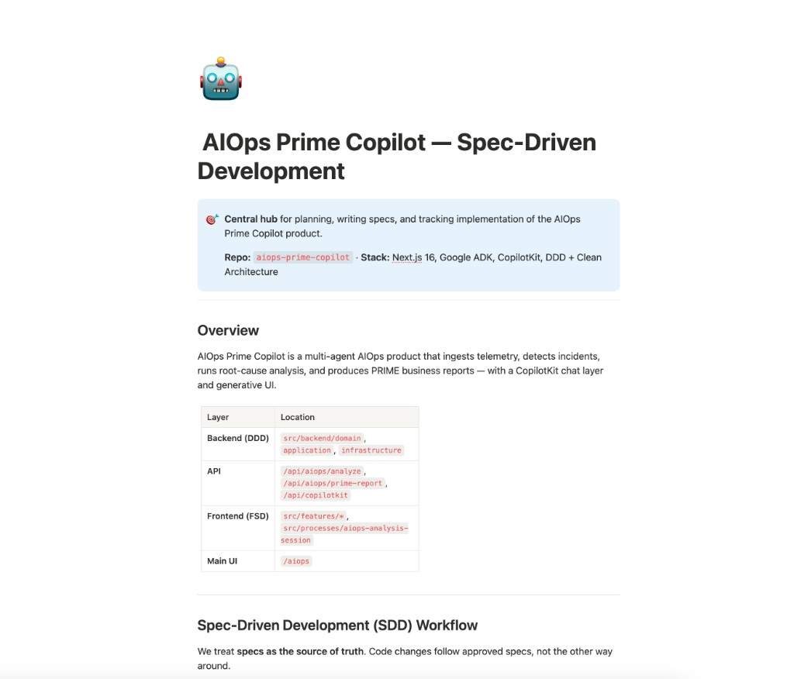
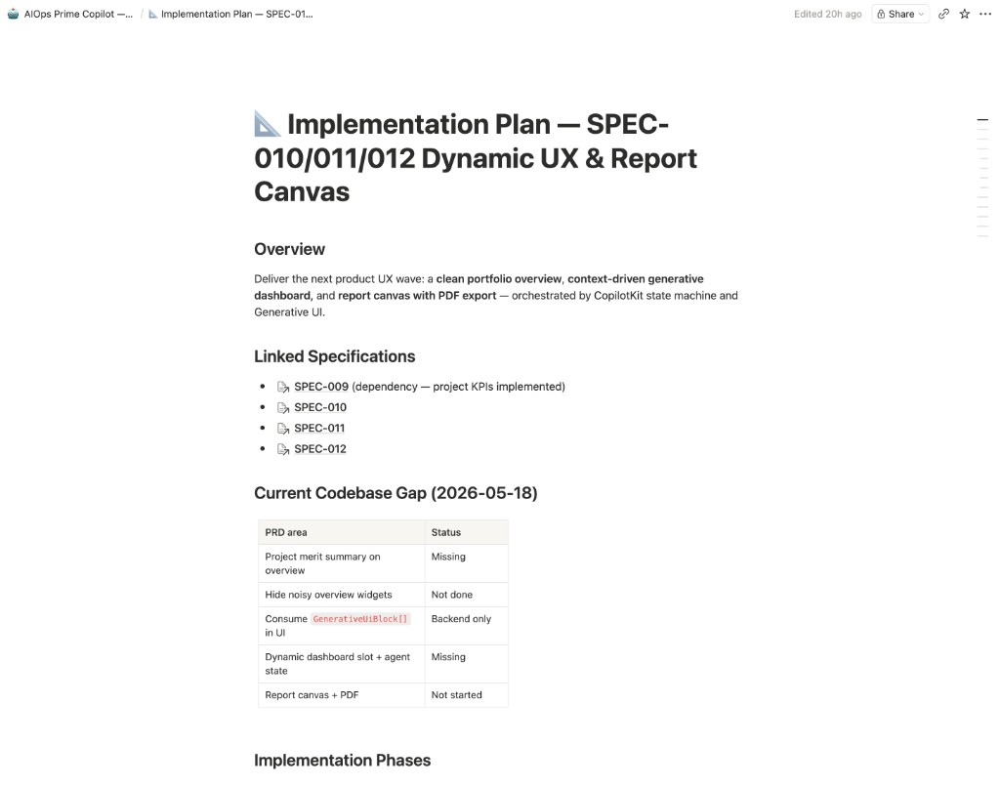
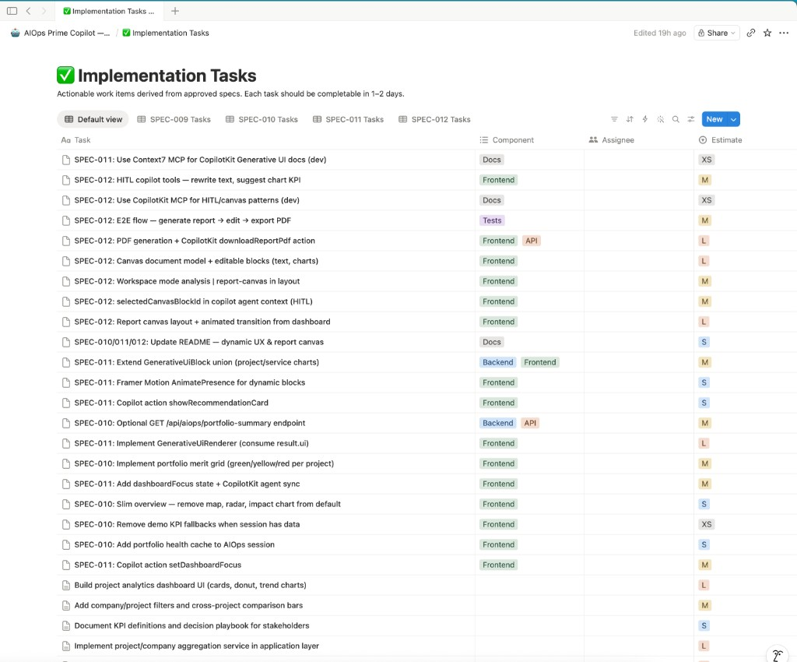

# Metodología y uso de IA en la construcción

Documento de referencia para el criterio **“Uso de IA en el proceso”** del reto. Índice: [ENTREGABLES.md](./ENTREGABLES.md).

**Hub Notion (specs):** [AIOps Prime Copilot — Spec-Driven Development](https://www.notion.so/AIOps-Prime-Copilot-Spec-Driven-Development-364c2144fd7f81c0bb14c3e5ffb6432f)

---

## Metodología: Spec-Driven Development (SDD)

Las **especificaciones aprobadas** (Notion) definen el qué; el código en Git es el cómo verificable. Flujo: **spec → plan → tareas → implementación → pruebas**.

| Paso | Qué hacemos |
|------|-------------|
| 1. **Spec** | PRD/SPEC en Notion (SPEC-009 analytics, SPEC-010/011/012 UX y report canvas) |
| 2. **Plan** | Plan de implementación con brechas vs. código actual |
| 3. **Tareas** | Ítems de 1–2 días por componente y estimación |
| 4. **Código** | DDD + use cases + ADK + CopilotKit |
| 5. **Verificación** | Vitest, Playwright, lint, build, demo manual |

### Referencias visuales (Notion)







---

## Stack de herramientas de IA (construcción)

Entorno: **Cursor**. División deliberada de roles entre modelos y extensiones:

```text
Claude  → planificación (specs, arquitectura, desglose de tareas, decisiones)
Codex   → ejecución (código, refactors, tests, fixes)
MCP     → documentación y APIs al día (Context7, CopilotKit MCP)
Skills  → dominios especializados (UX/UI, Google ADK, patrones Next/React)
```

### Modelos

| Herramienta | Rol en el proceso | Ejemplos de uso |
|-------------|-------------------|-----------------|
| **Claude** | **Planificación** | Descomponer SPEC en tareas, revisar trade-offs ADK vs. mega-agente, borrador de planes de implementación, estructura de docs |
| **Codex** | **Ejecución** | Implementar `copilot-adk-bridge`, workers ADK, hooks CopilotKit, tests, correcciones tras lint/CI |

### MCP (Model Context Protocol)

| MCP | Para qué |
|-----|----------|
| **Context7** | Docs actualizadas de librerías (CopilotKit, AG-UI, APIs de terceros) sin depender de memoria del modelo |
| **CopilotKit MCP** | Referencia específica del ecosistema CopilotKit al registrar tools, HITL y runtime v2 |

### Skills (agentes especializados en Cursor)

Se invocan cuando la tarea lo requiere, no en cada cambio:

| Dominio | Skills típicas | Cuándo |
|---------|----------------|--------|
| **UX / UI** | `ui-designer`, `ui-visual-guidelines-brain`, `microinteractions-trends-brain`, `accessibility-design-systems-brain` | Dashboard, tokens, motion, report canvas, HITL visual |
| **Google ADK / agentes** | Skills y docs de ADK (orquestador, `transfer_to_agent`, tools por worker) | Coordinador, puente AG-UI, prompts acotados |
| **Arquitectura frontend** | `ui-patterns-architecture-brain`, `vercel-react-best-practices` | FSD, sesión `artifactCache`, performance |

### Producto vs. IDE

| Capa | Tecnología |
|------|------------|
| **Construcción del repo** | Claude (plan) + Codex (código) + MCP + Skills |
| **Producto en runtime** | Google ADK + Gemini/Vertex + CopilotKit (multiagente entregable del reto) |

La IA del IDE **no** sustituye specs ni tests; acelera iteración bajo SDD.

---

## Verificación humana (siempre)

| Área | Asistencia IA | Control |
|------|---------------|---------|
| Puente ADK↔AG-UI | Codex + Context7 | `copilot-adk-bridge.test.ts`, stream manual |
| Agentes ADK | Codex + skills ADK | Use cases determinísticos; un rol por worker |
| Frontend CopilotKit | Codex + CopilotKit MCP + skills UX | E2E Playwright, `artifactCache` |
| Docs / entregables | Claude (estructura) + Codex (alineación) | Coherencia con código y reto |

---

## Sustentación (~30 s)

1. **SDD:** Notion hub, specs SPEC-009+, tareas trazables (capturas arriba).  
2. **IA en construcción:** Claude planifica, Codex ejecuta; MCP Context7 + CopilotKit; skills UX y ADK cuando aplica.  
3. **Producto:** ADK orchestrator–workers + CopilotKit en runtime.  
4. **Calidad:** tests, lint, build, demo `/aiops` — [decisiones-1-pagina.md](./platform/decisiones-1-pagina.md).

---

## Enlaces relacionados

| Tema | Documento |
|------|-----------|
| Arquitectura multiagente | [platform/diagramas/](./platform/diagramas/) |
| Decisiones | [platform/decisiones-1-pagina.md](./platform/decisiones-1-pagina.md) |
| SPEC-009 | [logic/project-company-analytics-spec.md](./logic/project-company-analytics-spec.md) |
| Demo | [DEMO-SUSTENTACION.md](./DEMO-SUSTENTACION.md) · [README.md](../README.md) |
