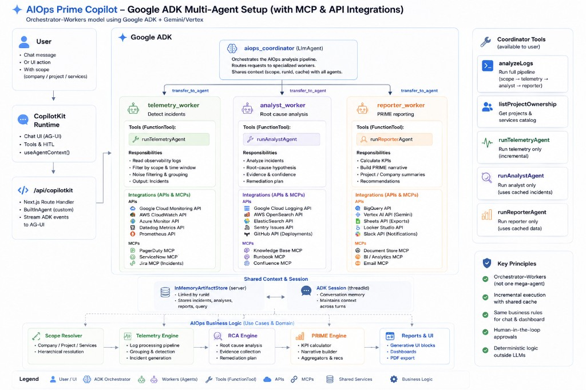
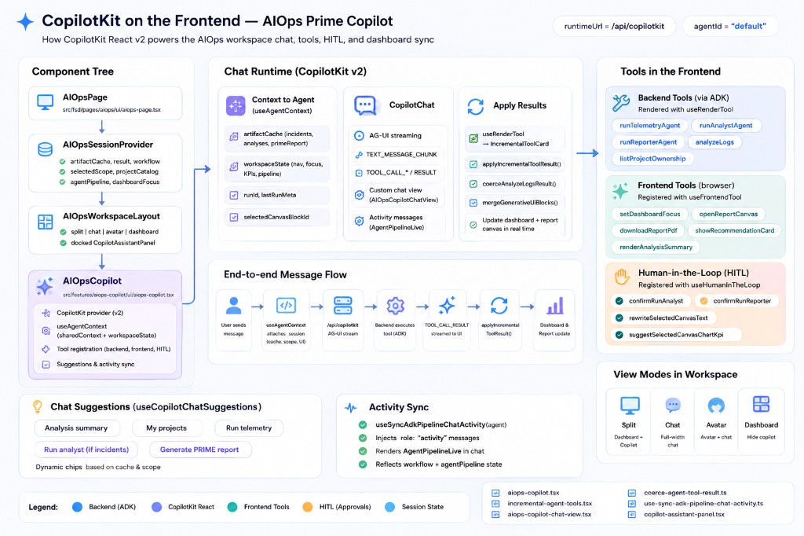
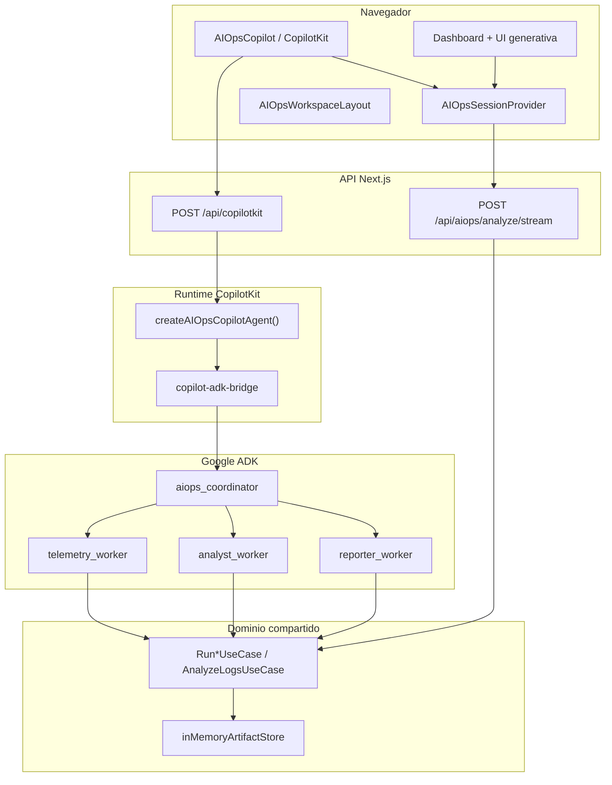
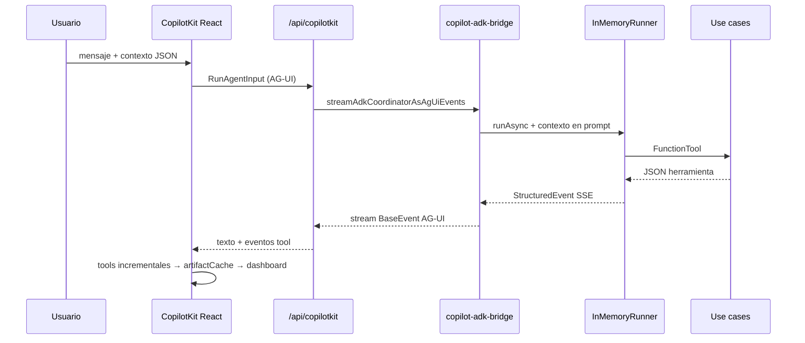
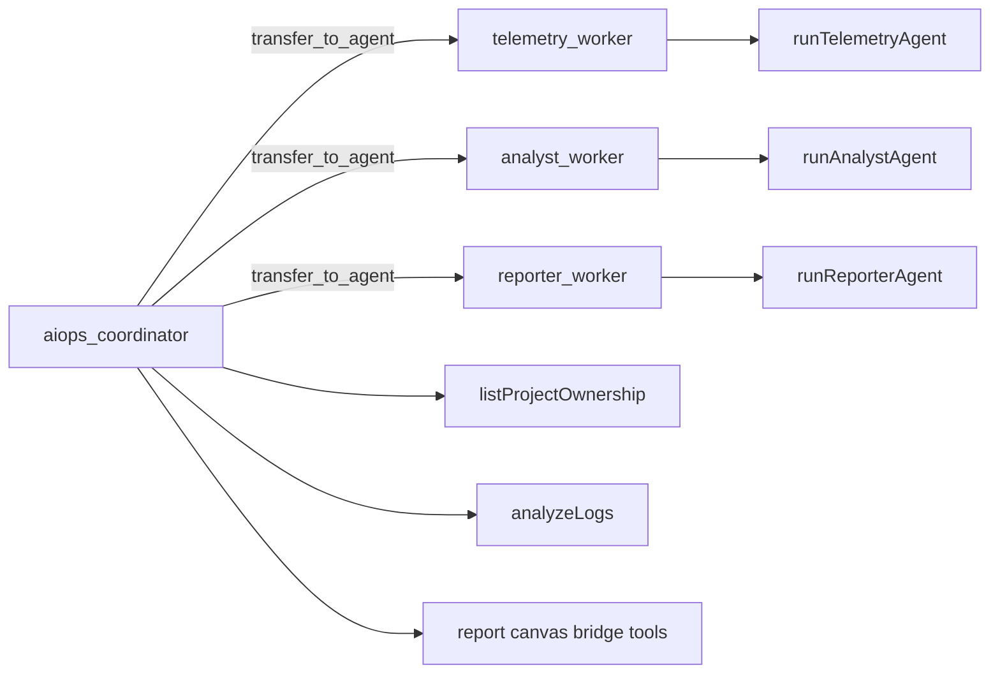
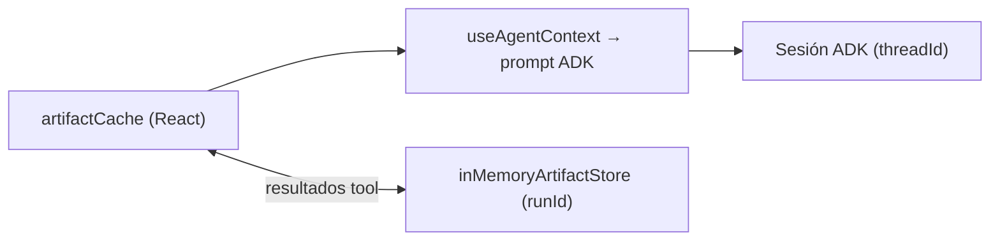

# Arquitectura de plataforma

Cómo encajan **CopilotKit**, **Google ADK** y el **pipeline de dominio AIOps** en una sola aplicación Next.js.

> **Entregable del reto:** diagramas en [diagramas/](./diagramas/) · decisiones en [decisiones-1-pagina.md](./decisiones-1-pagina.md) · versión extendida en [decisiones-arquitectura-agentes.md](../decisiones-arquitectura-agentes.md)

---

## Diagramas oficiales (entregable)

### Orquestación multiagente — Google ADK



**Incluye:** usuario, CopilotKit runtime, `POST /api/copilotkit`, `aiops_coordinator`, workers (`telemetry_worker`, `analyst_worker`, `reporter_worker`), herramientas, integraciones y store compartido por `runId`.

### Frontend — CopilotKit y flujo de mensajes



**Incluye:** árbol React (`AIOpsCopilot`, sesión), `useAgentContext`, herramientas backend/frontend/HITL, flujo hasta actualización de dashboard y report canvas.

---

## Tres capas

| Capa | Rol | Tecnología |
|------|-----|------------|
| **Experiencia** | Chat, dashboard, report canvas, HITL | React, CopilotKit, Framer Motion |
| **Orquestación de chat** | Enrutar intención del usuario a workers | Google ADK `aiops_coordinator` |
| **Trabajo de dominio** | Incidentes, RCA, reporte PRIME | Use cases TypeScript + servicios de dominio |

**CopilotKit no es el cerebro** cuando Gemini/Vertex está configurado. Es el **runtime AG-UI + UI**. ADK orquesta el chat.

---

## Diagrama de sistema (Mermaid — referencia en texto)



---

## Flujo de petición en chat (secuencia)



---

## Grafo del coordinador ADK



Los workers **no se llaman entre sí**. Comparten datos solo vía `runId` + store en servidor (ver [logic/README.md](../logic/README.md)).

### Herramientas del coordinador (resumen)

| Grupo | Tools | Ejecuta en |
|-------|-------|------------|
| **Backend** | `listProjectOwnership`, `runTelemetryAgent`, `runAnalystAgent`, `runReporterAgent`, `analyzeLogs` | Servidor (use cases) |
| **Puente frontend** | `setDashboardFocus`, `openReportCanvas`, `downloadReportPdf`, `selectReportSection`, `startReportSectionEdit`, `updateReportSection`, `setReportSectionReviewStatus`, `suggestReportSectionEdits`, `confirmRejectReportSection`, `rewriteSelectedCanvasText`, `suggestSelectedCanvasChartKpi`, `showRecommendationCard`, `renderAnalysisSummary` | Navegador (`useFrontendTool`); ADK emite la llamada y el bridge la reenvía a AG-UI |

Las tools de **puente** están definidas en `aiops-coordinator-tools.ts` con `createFrontendBridgeTool` para que el modelo las conozca en el prompt; el handler real vive en `aiops-copilot.tsx`.

---

## Dos caminos de ejecución (mismas reglas de negocio)

| Camino | Disparador | Orquestador | UI de progreso |
|--------|------------|-------------|----------------|
| **A — Chat** | Mensaje en copilot | Coordinador ADK (o fallback `BuiltInAgent`) | Tools en chat + actividad pipeline |
| **B — Dashboard** | Botón analizar / API stream | `AnalyzeLogsUseCase` | `agentPipeline` + eventos SSE |

---

## Puente CopilotKit ↔ ADK

| Archivo | Responsabilidad |
|---------|-----------------|
| `src/app/api/copilotkit/route.ts` | `CopilotRuntime` + handler |
| `src/app/api/copilotkit/create-aiops-copilot-agent.ts` | Agente ADK vs fallback legacy |
| `src/backend/infrastructure/adk/copilot-adk-bridge.ts` | `InMemoryRunner`, prompt con contexto, SSE |
| `src/backend/infrastructure/adk/copilot-adk-bridge-mapper.ts` | Mapeo ADK → eventos AG-UI |

**Fallback:** si `isAdkOrchestratorAvailable()` es falso, `BuiltInAgent` de CopilotKit ejecuta las mismas tools vía `defineTool` (sin ADK).

Comprobar runtime: `GET /api/aiops/runtime-status` o `describeAIOpsCopilotOrchestrator()`.

---

## Estado (doble caché)



- **Caché cliente** — alimenta dashboard y UI generativa en la sesión del navegador.
- **Store servidor** — enlaza analista/reporter con telemetría; **se pierde al reiniciar** el servidor.
- **Sesión ADK** — memoria conversacional por `threadId`.

---

## Pila de protocolos

```text
UI React
  → CopilotKit React (tools, HITL, useAgentContext)
    → AG-UI (eventos @ag-ui/client)
      → CopilotKit Runtime v2
        → factory BuiltInAgent OR legacy BuiltInAgent
          → copilot-adk-bridge (si ADK)
            → Google ADK + Gemini/Vertex
              → Use cases + dominio
```

Detalle UI: [../ui/ag-ui-protocol.md](../ui/ag-ui-protocol.md)

---

## Variables de entorno clave

| Variable | Efecto |
|----------|--------|
| `GOOGLE_API_KEY` / flags Vertex | Habilita orquestador ADK |
| `NEXT_PUBLIC_COPILOT_RUNTIME_URL` | Endpoint Copilot (default `/api/copilotkit`) |
| `COPILOTKIT_MODEL` | Modelo del fallback legacy |

---

## Índice de archivos

| Tema | Ruta |
|------|------|
| Ruta Copilot | `src/app/api/copilotkit/route.ts` |
| Factory agente | `src/app/api/copilotkit/create-aiops-copilot-agent.ts` |
| Coordinador ADK | `src/backend/infrastructure/adk/aiops-coordinator.ts` |
| Tools ADK | `src/backend/infrastructure/adk/aiops-coordinator-tools.ts` |
| Sesión (cliente) | `src/processes/aiops-analysis-session/model/aiops-session-context.tsx` |
| UI chat | `src/features/aiops-copilot/ui/aiops-copilot.tsx` |
