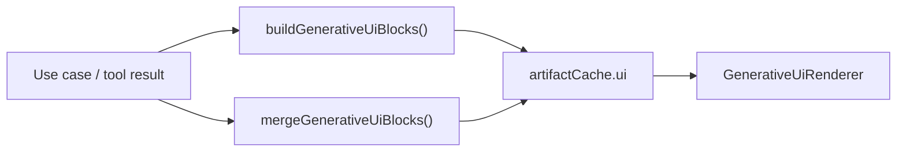

# Generative UI

In this project, **generative UI** means: the backend (or client builder) produces a **typed list of UI blocks** (`GenerativeUiBlock[]`) that the dashboard renders as React components—without the LLM writing arbitrary JSX.

This is **separate from AG-UI** (which streams chat/tool events). Generative UI is a **data contract** carried on `AnalyzeLogsResult.ui` and in the session `artifactCache`.

---

## Data flow



| Step | File |
|------|------|
| Build blocks from domain | `src/shared/lib/build-generative-ui-blocks.ts` |
| Merge on tool apply | `src/shared/lib/coerce-agent-tool-result.ts` |
| Also from mappers | `src/backend/application/shared/analysis-mappers.ts` |
| Types | `src/shared/types/aiops.ts` |
| Render | `src/features/operations-dashboard/ui/generative-ui-renderer.tsx` |
| Motion / keys | `src/features/operations-dashboard/ui/dashboard-motion.ts` |

---

## Block catalog

Defined as a discriminated union on `type`:

| `type` | Component / panel | When added |
|--------|-------------------|------------|
| `IncidentTable` | `ActiveIncidentsTable` | Always when incidents exist |
| `RecommendationCard` | Styled priority card | After analyst (top analysis) |
| `PrimeKpiCards` | `PrimeKpiGrid` | When PRIME report has KPIs |
| `PrimeNarrative` | `PrimeNarrative` | When narrative / business summary |
| `ProjectHealthCards` | `ProjectHealthCards` | Project-scoped report |
| `ProjectSeverityDonut` | `ProjectSeverityDonut` | Project analytics |
| `ProjectServiceBarChart` | `ProjectServiceBarChart` | Project analytics |
| `ProjectIncidentTrendChart` | `ProjectIncidentTrendChart` | Trend points available |

Example shape:

```typescript
{
  type: "RecommendationCard",
  props: {
    title: "Root cause: …",
    priority: "P0" | "P1" | "P2",
    riskLevel: "high" | "medium" | "low",
    content: string,
  },
}
```

Full union: `GenerativeUiBlock` in `src/shared/types/aiops.ts`.

---

## Builder logic

`buildGenerativeUiBlocks({ incidents, analyses?, primeReport? })`:

1. Always emits `IncidentTable` if there are incidents.
2. Adds `RecommendationCard` from the first analysis (confidence → priority/risk).
3. Adds PRIME blocks when report has KPIs or narrative.
4. Adds project chart blocks when `projectSummary` / analytics data exists.

Tests: `src/shared/lib/build-generative-ui-blocks.test.ts`

---

## Rendering

`GenerativeUiRenderer` (`generative-ui-renderer.tsx`):

- Maps each block via `renderBlockContent()`.
- Wraps in `DashboardPanel` or entity components.
- Uses Framer Motion variants from `dashboard-motion.ts` (`generativeUiBlockKey`, stagger).
- Respects `prefers-reduced-motion`.

**Layout:** `blockSpanClass()` assigns grid span (e.g. charts vs full-width table).

---

## When blocks update

| Source | Mechanism |
|--------|-----------|
| Copilot `runTelemetryAgent` | `applyIncrementalToolResult` → cache → `ui` merge |
| Copilot `runAnalystAgent` / `runReporterAgent` | same |
| Dashboard **Analyze** stream | `mergeGenerativeUiBlocks` in session on progress events |
| Full `analyzeLogs` | Complete `ui` array on result |

Session: `src/processes/aiops-analysis-session/model/aiops-session-context.tsx`

---

## How to add a new block type

1. Extend `GenerativeUiBlock` in `src/shared/types/aiops.ts` (and backend contract if duplicated).
2. Add construction branch in `build-generative-ui-blocks.ts`.
3. Add `renderBlockContent` case in `generative-ui-renderer.tsx`.
4. Optional: span rules in `blockSpanClass()`.
5. Add test fixture in `build-generative-ui-blocks.test.ts`.

Keep blocks **serializable** (props = plain JSON-friendly data). No React nodes in props.

---

## Chat vs dashboard

| Surface | Generative UI role |
|---------|-------------------|
| **Dashboard** | Primary display via `GenerativeUiRenderer` + dynamic context slots |
| **Chat** | Short status only; tools may show cards via `useRenderTool` |

Product rule (also in ADK/legacy prompts): do not paste full incident tables or report narrative in chat after tools run.

---

## Related

- [ag-ui-protocol.md](./ag-ui-protocol.md) — streaming chat protocol
- [design-tokens.md](./design-tokens.md) — colors for severity / recommendation cards
- [../logic/README.md](../logic/README.md) — pipeline that produces incidents/analyses/report
